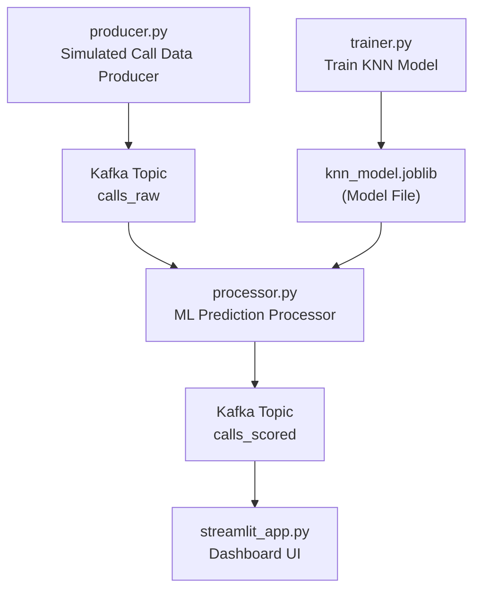

# Live Scam Call Detector

A real-time streaming pipeline simulating phone call events, processing them with machine learning to detect scam calls, and displaying results on a live Streamlit dashboard.

---

## About the Project

This project demonstrates a full **end-to-end streaming data pipeline** using Python and Apache Kafka. It simulates phone calls, applies a K-Nearest Neighbors (KNN) machine learning model to classify calls as *scam* or *not scam*, and streams the predictions live on a dashboard.

The goal is to showcase real-time event streaming, ML inference, and interactive visualization, similar to systems used in fraud detection or telecom monitoring.

---

## Tools & Technologies Used

- **Apache Kafka & Zookeeper** (via Docker) for streaming  
- **Python** (with aiokafka, kafka-python, scikit-learn, pandas, numpy)  
- **Machine Learning**: K-Nearest Neighbors classifier trained on synthetic data  
- **Streamlit**: Interactive dashboard for real-time visualization  
- **Docker & Docker Compose** for Kafka environment management  

---

## Concepts Demonstrated

- **Real-Time Streaming**: Continuous event flow from producer to consumer.  
- **Producer-Consumer Model**: Separate processes produce data, consume data, and run ML predictions.  
- **Machine Learning Inference**: KNN model predicts scam likelihood from call features.  
- **Event Flow**:  
  `producer.py` → Kafka topic `calls_raw` → `processor.py` → Kafka topic `calls_scored` → Streamlit UI  

---

## Architecture Diagram

## How to Use the Streamlit website?

The dashboard auto-refreshes and shows live predictions from the streaming pipeline.

Columns displayed include:

- Caller: Simulated phone number
- Duration (s): Call length in seconds
- Hour: Hour of day call was made
- Freq Calls: Number of calls by the caller (frequency)
- Scam (1) / Not (0): Model prediction label
- Processed Timestamp: When the event was processed

Here’s the Streamlit demo:
https://appappfallbackpy-52v8ru6ga98qsxswauscgd.streamlit.app/

## Next Steps / Recommendations

- Integrate real telecom or VoIP data sources.
- Add more sophisticated ML models or online learning (Edit trainer.py).
- Deploy Kafka and services to cloud platforms like Azure or AWS (Ongoing after I regain my access credentials).
- Automate model retraining and deployment pipelines.
